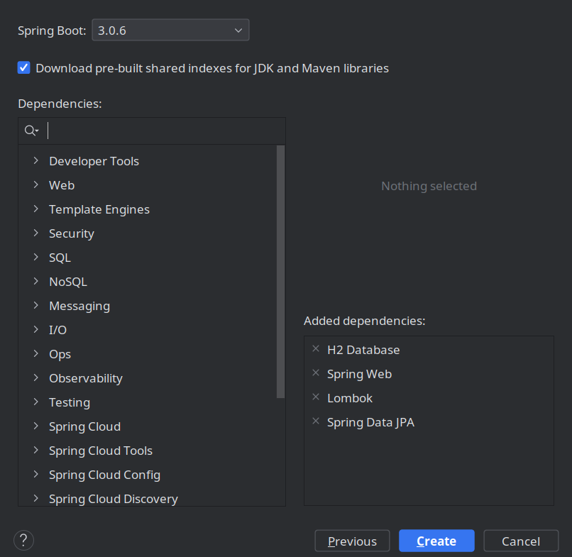
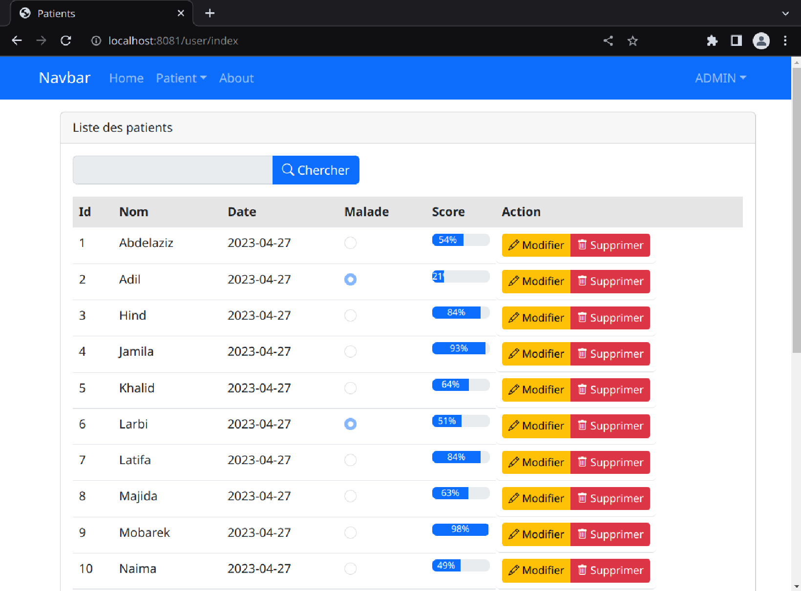
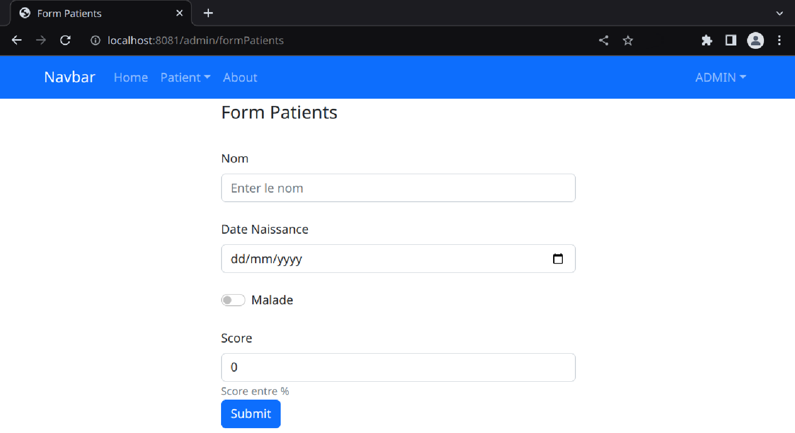
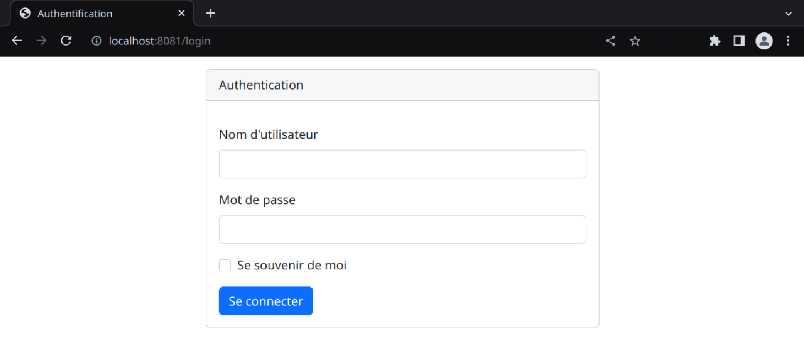

> Younes AMZIL	 																												27 Avr. 23
>
> 4IIR Groupe 5 | EMSI Orangers 

***

# Rapport Controle J2EE

**Créer un projet Java avec Spring Initializr de type Maven:**



**Créer l'entité JPA Patient**

```java
@Entity
@Data @NoArgsConstructor @AllArgsConstructor
public class Patient {
	@Id @GeneratedValue(strategy = GenerationType.IDENTITY)
	private Long id;
	@NotEmpty
	@Size(min = 2, max = 40)
	private String nom;
	@Temporal(TemporalType.DATE)
	private Date dateNaissance;
	private boolean malade;
	@DecimalMax("100")
	private int score;
}
```

**Configurer le fichier `application.properties`**

- avec *mariadb*

```properties
spring.datasource.url=jdbc:h2:mem:patients_db
spring.h2.console.enabled=true
server.port=8081
```

- avec *h2-database*

```properties
spring.datasource.url=jdbc:mariadb://localhost:8082/patients_db
spring.datasource.username=root
spring.datasource.password=root
spring.jpa.hibernate.ddl-auto=create
spring.jpa.properties.hibernate.dialect=org.hibernate.dialect.MariaDBDialect
server.port=8081
```

**Tester la méthode Chercher dans `PatientRepository`**

```java
public interface PatientRepository extends JpaRepository<Patient, Long> {
	Page<Patient> findByNomContainsIgnoreCase(String kw, Pageable pageable);
}
```

**Créer le contrôleur de chaque chemin des patients `PatientControler`**

```java
public String patients(Model model, ...) {
		Page<Patient> pagePatients = patientRepository
            .findByNomContainsIgnoreCase(keyword, PageRequest.of(page, size));
		... 
		return "patients";
	}
```

**Ajouter la vue `patients.html` pour afficher la liste des patients**

- Bar de recherche

```html
<form method="get" th:action="@{/user/index}">
    <input type="text" name="keyword" th:value="${keyword}">
    <button type="submit"> Chercher </button>
</form>
```

- Liste des patients

```html
<table class="table mt-3">
    ...
    <tr th:each="p:${listPatients}">
        <td th:text="${p.id}"></td>
        <td th:text="${p.nom}"></td>
        <td th:text="${p.datenaissance}"></td>
        ...
        <td th:if="${#authorization.expression('hasRole(''ADMIN'')')}">
        	Visible pour l'admin seul
            <a th:href="@{/admin/editPatient(id=${p.id})}"> Modifier </a>
            <a th:href="@{/admin/delete(id=${p.id}"> Supprimer </a>
        </td>
    </tr>
    ...
</table>
```

- Liste des pages

```html
<div role="group">
    <button th:each="page,status:${pages}">
        <a th:text="${status.index}"
           th:href="@{/user/index(page=${status.index}, keyword=${keyword})}"></a>
    </button>
</div>
```



**Vue `formPatients.html` & Contrôleur pour remplir le formulaire des patients**

```html
<form method="post" th:action="@{/admin/save}">
    Nom <input type="text" th:value="${pat.nom}" name="nom">
    Date Naissa.. <input type="date" th:value="${pat.datenaissance}" name="datenaissance">
    ...
    <button type="submit">Submit</button>
</form>
```

```java
@PostMapping(path = "/admin/save")
@PreAuthorize("hasRole('ROLE_ADMIN')")
public String save(Model model, @Valid Patient patient, BindingResult bindingResult) {
    if (bindingResult.hasErrors())  return "formPatients";
    patientRepository.save(patient);
    return "redirect:/user/index";
}
```



**Page d'authentification**



# Docker

Tester l'application web sur Docker
```bash
docker pull 0xuns/mvc-patients
docker -ti run -p 8081:8081 0xuns/mvc-patients
```

